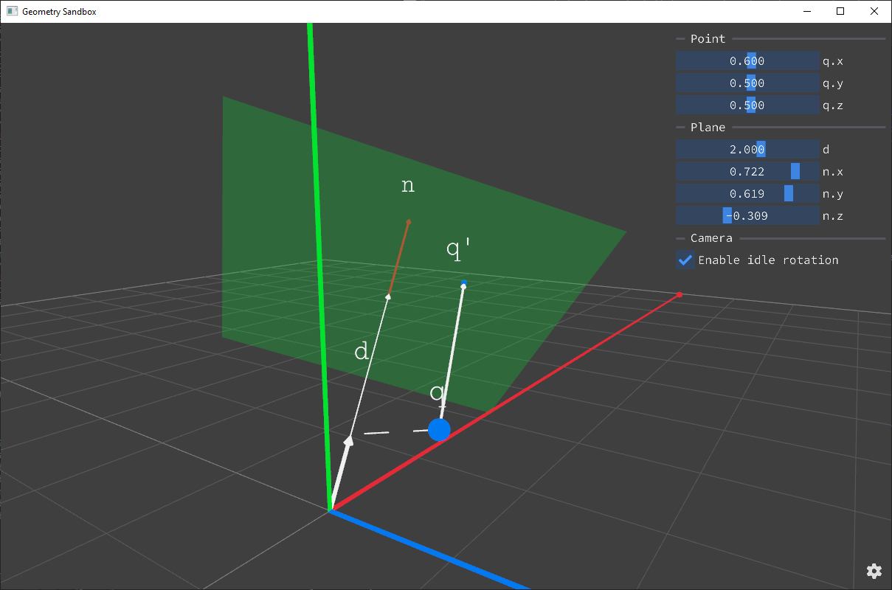



    <h3><b>Geometry Sandbox</b></h3>
    <i>A sandbox for geometric ideas, interactive demos, and quick animations</i> 
    
    
    

## Features

#### ⚙️ Animation Core
- **Any-level Property Interpolators:** setup the interpolation logic for properties at *any* nesting level, not just top-level transforms.
- **Compile-Time DSL Checks:** the animation DSL is validated **at compile time** — syntax errors, invalid property paths, and type mismatches

#### ⚡ High-Performance Rendering
- **Massive Object Count:** visualize **10K+ entities** simultaneously.
- **Optimized Architecture:** combines **Data-Oriented Design** (cache-friendly memory layout) with **GPU Instancing** (minimal draw calls).

#### 🛠 Tech Stack
- **raylib** – a simple and easy-to-use library to enjoy videogames programming.
- **EnTT** – a fast and reliable entity component system (ECS).
- **Dear Imgui** – bloat-free Graphical User interface for C++ with minimal dependencies.
- **Eigen** – a C++ template library for linear algebra: matrices, vectors, numerical solvers, and related algorithms.

#### 🦴 Development & Build
- **Multi-Platform:** native **Windows** builds + **WebAssembly (WASM)** browser deployment.
- **Quality Assurance:** **Unit Tests**, **Linter / Static analyzer**, **Sanitizers**, **Doxygen** documentation, and **Performance Benchmarks**.

## Getting Started

Check out:

- `.\scripts\build_web.bat` compiles with emscripten
- `.\scripts\start_server.bat` deploys on localhost:8000
- `.\scripts\build_windows.bat` compiles with default

## 📚 Documentation & Samples

Documentation is available at [novikovnick.github.io/geometry-sandbox](https://novikovnick.github.io/geometry-sandbox/)

Docs are generated via [Doxygen](https://www.doxygen.nl/) from source file comments and from markdown files in the `docs/pages` directory.

| | |
|---|---|
|  | **Closest point on plane**   This is a simple example of an interactive visualization of a geometric formula. This format is perfect for personal notes or articles. |

## ⚖ License
 
Geometry Sandbox is licensed under the MIT license.
